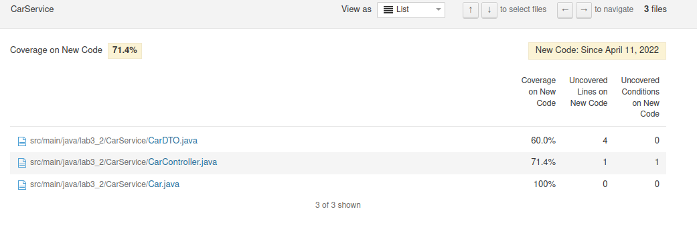

# lab 6
* ex3
a)
The technical debt found in this project is 1h 7min, which means it will take 1h 7min to fix the Maintainability Issue and code smells.

b)
I only have 1 major code smell, suggesting me to remove a commented line of code in CarRepository
"Programmers should not comment out code as it bloats programs and reduces readability."
1 vulnerability -> Can't use persistent entitie as arguments of @RequestMapping, fixed
1 bug -> was using Optional.get() without the verification of the preence of elements, fixed.

d)

* 19 lines to cover and 5 lines uncovers
* 2 conditions to cover and 1 unconvered condition